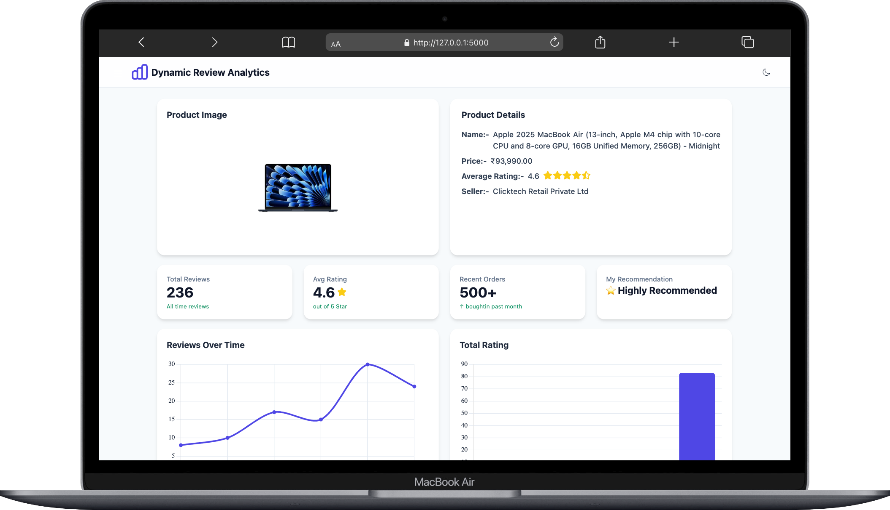
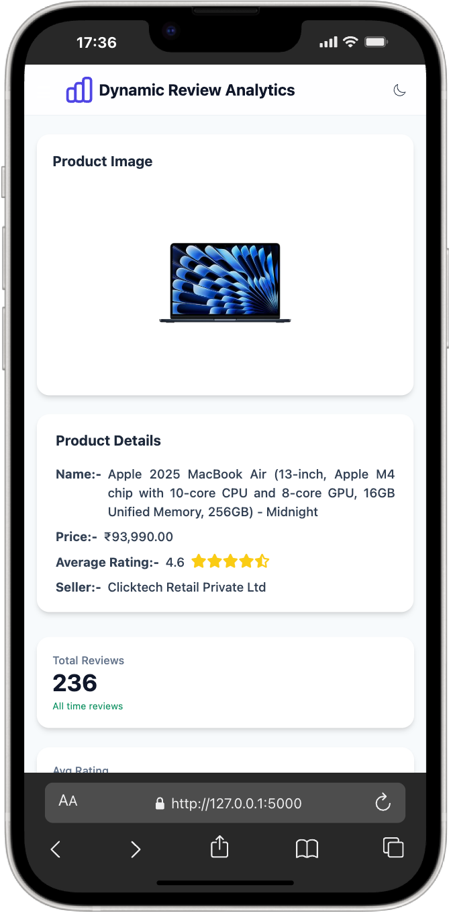
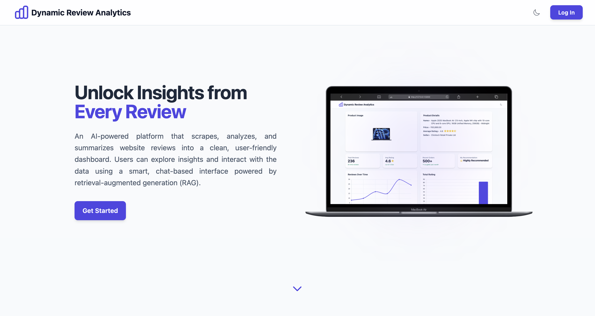
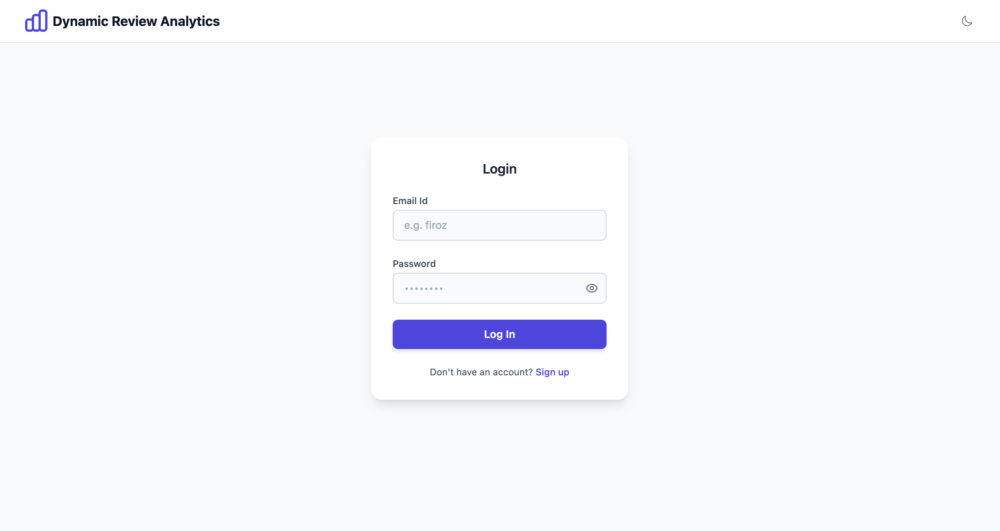
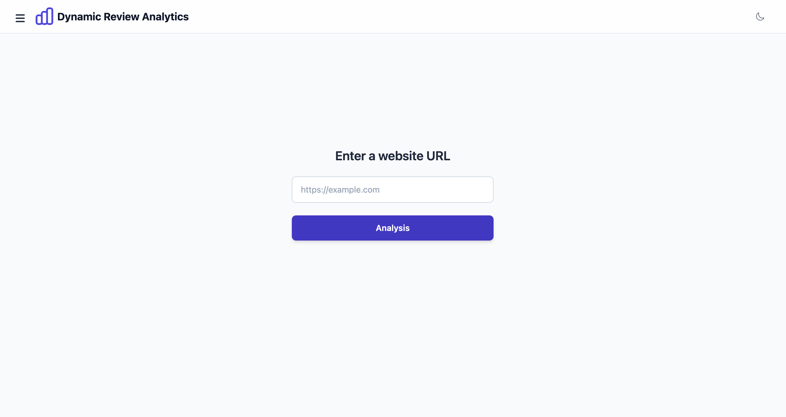
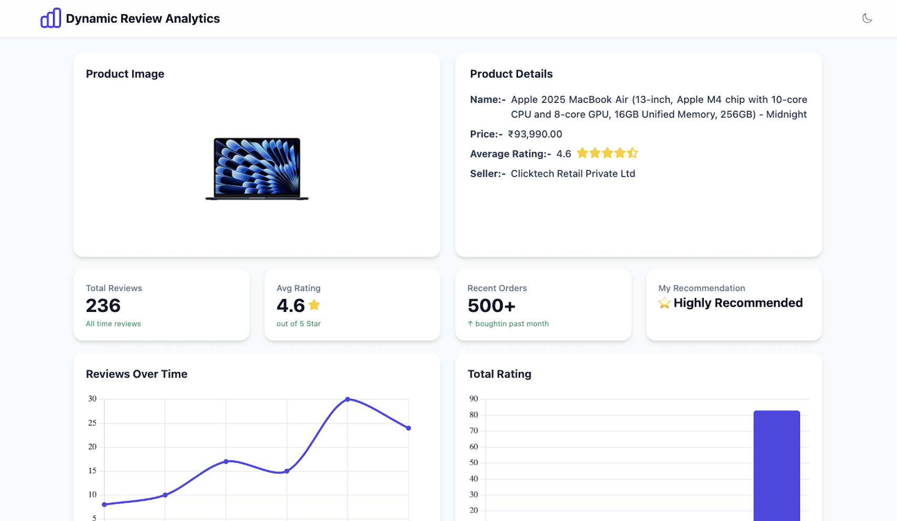

# Intern-Project (Dynamic-Review-Analysis)

**Dynamic-Review-Analysis** is an AI-powered platform designed to help users **scrape, analyze, and visualize reviews** from websites.  

- Scrape reviews from the websites   
- Display results in a clean, user-friendly dashboard 

---

## 🛠️ Tech Stack 

 &nbsp;&nbsp;
 &nbsp;&nbsp;
 &nbsp;&nbsp;
 &nbsp;&nbsp;
 &nbsp;&nbsp;
 &nbsp;&nbsp;
 &nbsp;&nbsp;

<br>

<!-- images -->

<div style="display: flex; justify-content: center; align-items: center; gap: 20px;">
    <div style="col-span-2">
        
    </div>
    <div style="col-span-1">
        
    </div>
</div>

<br>

## Project Overview

**Current Features:**  
- Web scraping engine (static + dynamic pages)  
- Sentiment analysis & keyword extraction  
- Dashboard with KPIs + charts  

**Future Work (Planned):**  
- Chat interface for querying reviews (via Retrieval-Augmented Generation - RAG)  
- Vector database integration for semantic search  

---

## Objectives

- Provide insights into user reviews (sentiment, common themes, trends).  
- Keep the platform **simple & intuitive** for non-technical users.  

---

## Core Features (Implemented)
### 1. Web Scraping  
- Extracts reviews with **BeautifulSoup** / **Playwright**  
- Handles pagination & dynamic content  

### 2. Dashboard  
- **KPIs:**  
  - Total reviews  
  - Avg. rating score  
  - Recent Orders  
  - Recommendation
- **Visuals:**  
  - Bar chart (Rating)  
  - Line chart (Montly Review) 
- **Latest Review:**  
  - Latest five review

---

## Getting Started  

> [!NOTE]
>
> Setup is quick & beginner-friendly.  
>
> **Step 1:**  
> Clone the repository  
> ```bash
> git clone https://github.com/buildwithfiroz/AI-Team-Intern-Collaboration.git
> ```
>
> **Step 2:**  
> Create a virtual environment  
> ```bash
> python3 -m venv myenv
> ```
>
> **Step 3:**  
> Activate the virtual environment  
> - On macOS/Linux:  
>   ```bash
>   source myenv/bin/activate
>   ```
> - On Windows (PowerShell):  
>   ```powershell
>   .\myenv\Scripts\Activate.ps1
>   ```
>
> **Step 4:**  
> Install the dependencies  
> ```bash
> pip install -r requirements.txt
> ```
> 
> **Step 5:**  
> Run the app  
> ```bash
> cd main
> python app.py
> ```

<br>

---

## 🚀 How to Use

Follow these simple steps to use the platform:

---

### Step 1: Landing Page  
You will first see the **Landing Page**.  
Click **Get Started** or **Login** to continue.  



---

### Step 2: Login / Register  
- If you already have an account → Enter your **Email ID & Password**.  
- If you don’t → Click on **Sign Up** and create a new account.  



---

### Step 3: Enter Product URL  
Paste the **Product URL** into the input box and click on **Analyze**.  



---

### Step 4: Dashboard View  
The **Dashboard** will appear.  
Here you can see:  
- Product Image
- Product Information  
- KPI
- Latest Reviews  
- Charts 



---


<br>
---

## System Requirements

To run this project smoothly, make sure your system meets the following minimum requirements:

### For All Platforms (Linux / macOS / Windows)
- **Disk Space:** 500 MB free (project files + dependencies)  
- **RAM:** 2 GB minimum (4 GB recommended for Playwright scraping)  
- **Python:** 3.11+  
- **Internet:** Required (to scrape reviews and install packages)  
<br>

---

## 👨‍💻 Team Contributions

<table style="border-collapse: collapse; width: 420px;">
  <thead>
    <tr>
      <th style="border: 1px solid #ddd; padding: 8px; text-align: left;">Member</th>
      <th style="border: 1px solid #ddd; padding: 8px; text-align: left;">Contribution</th>
    </tr>
  </thead>
  <tbody>
    <tr>
      <td style="border: 1px solid #ddd; padding: 8px;"><strong>Nehal</strong></td>
      <td style="border: 1px solid #ddd; padding: 8px;">~58%</td>
    </tr>
    <tr>
      <td style="border: 1px solid #ddd; padding: 8px;"><strong>Romman</strong></td>
      <td style="border: 1px solid #ddd; padding: 8px;">~21%</td>
    </tr>
    <tr>
      <td style="border: 1px solid #ddd; padding: 8px;"><strong>Huzaifa</strong></td>
      <td style="border: 1px solid #ddd; padding: 8px;">~14%</td>
    </tr>
    <tr>
      <td style="border: 1px solid #ddd; padding: 8px;"><strong>Firoz</strong></td>
      <td style="border: 1px solid #ddd; padding: 8px;">~7%</td>
    </tr>
  </tbody>
</table>


<br>

---

## Author - Contact Information

<br>

This project is proudly built and maintained by Nexgeno AI Dept.

<br>

<div align="center" style="display: flex">

  <a href="https://github.com/buildwithfiroz">
    
  </a>

  <a href="https://github.com/Nehal-Khan-AI">
    
  </a>

  <a href="https://github.com/Officialhuzaifa">
    
  </a>

  <a href="https://github.com/rommaan30">
    
  </a>

</div>

---
<br>

<p align="center"><b>Made with ❤️ by AI Dept Nexgeno</b></p>

